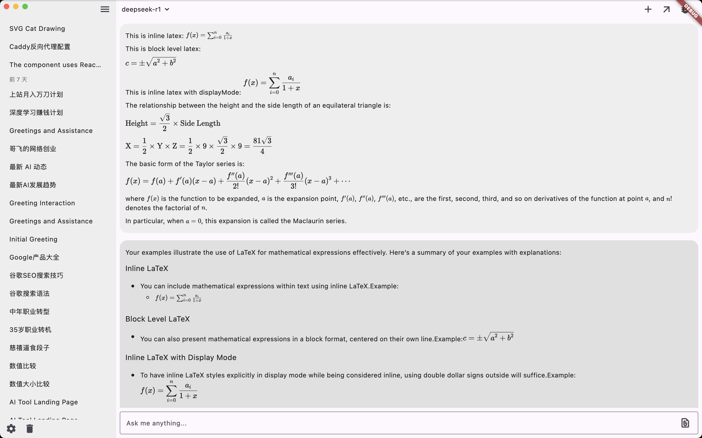

<div align="center">

<h1>chatmcp</h1>

Cross-platform `Macos | Windows | Linux | iOS | Android` AI Chat Client

[English](./README.md) | [简体中文](./README_ZH.md)

</div>

## Install

| macOS | Windows | Linux | iOS | Android |
|-------|---------|-------|------|---------|
| [Release](https://github.com/daodao97/chatmcp/releases) | [Release](https://github.com/daodao97/chatmcp/releases) | [Release](https://github.com/daodao97/chatmcp/releases) ¹ | [TestFlight](https://testflight.apple.com/join/dCXksFJV) | [Release](https://github.com/daodao97/chatmcp/releases) |

¹ Note: On Linux you need to install libsqlite3-0 libsqlite3-dev, as this dependency needs it https://pub.dev/packages/sqflite_common_ffi

```bash
sudo apt-get install libsqlite3-0 libsqlite3-dev
```

## Preview





## Usage

Make sure you have installed `uvx` or `npx` in your system

### MacOS
```bash
# uvx
brew install uv

# npx
brew install node 
```

### Linux 
```bash
# uvx
curl -LsSf https://astral.sh/uv/install.sh | sh

# npx (using apt)
sudo apt update
sudo apt install nodejs npm
```

1. Configure Your LLM API Key and Endpoint in `Setting` Page
2. Install MCP Server from `MCP Server` Page
3. Chat with MCP Server

- stdio mcp server


- sse mcp server


## Debug 

- logs & data

macOS:
```bash
~/Library/Application Support/ChatMcp
```

Windows:
```bash
%APPDATA%\ChatMcp
```

Linux:
```bash
~/.local/share/ChatMcp
```

Mobile:
- Application Documents Directory

reset app can use this command

macOS:
```bash
rm -rf ~/Library/Application\ Support/ChatMcp
```

Windows:
```bash
rd /s /q "%APPDATA%\ChatMcp"
```

Linux:
```bash
rm -rf ~/.local/share/ChatMcp
```

## Development

```bash
flutter pub get
flutter run -d macos
```

## Features

- [x] Chat with MCP Server
- [ ] MCP Server Market
- [ ] Auto install MCP Server
- [x] SSE MCP Transport Support
- [x] Auto Choose MCP Server
- [x] Chat History
- [x] OpenAI LLM Model
- [x] Claude LLM Model
- [x] OLLama LLM Model
- [x] DeepSeek LLM Model
- [ ] RAG 
- [ ] Better UI Design
- [x] Dark/Light Theme

All features are welcome to submit, you can submit your ideas or bugs in [Issues](https://github.com/daodao97/chatmcp/issues)

## MCP Server Market

You can install MCP Server from MCP Server Market, MCP Server Market is a collection of MCP Server, you can use it to chat with different data.

Your feedback helps us improve chatmcp and helps other users make informed decisions.

## Thanks

- [MCP](https://modelcontextprotocol.io/introduction)
- [mcp-cli](https://github.com/chrishayuk/mcp-cli)

## License

This project is licensed under the [Apache License 2.0](./LICENSE).

## Star History

