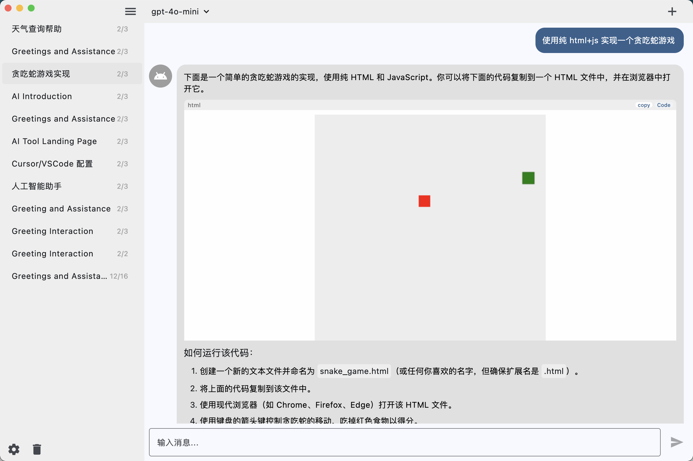
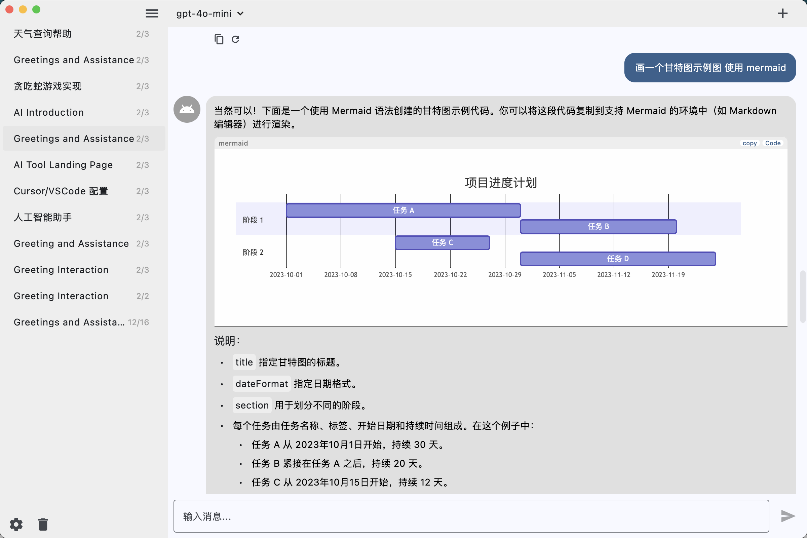
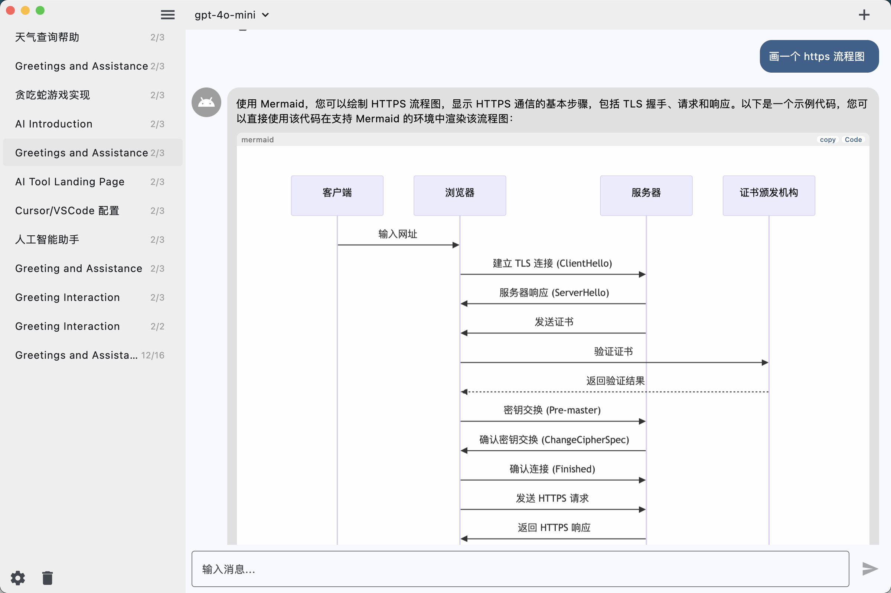
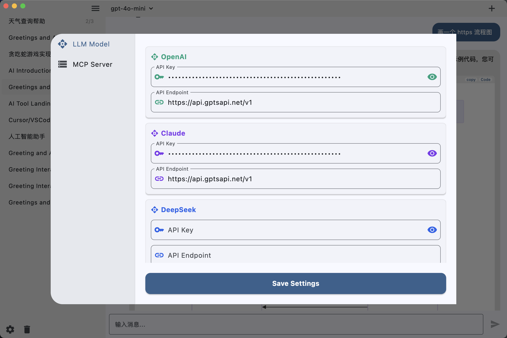

<div align="center">

<h1>chatmcp</h1>

AI Chat with [MCP](https://modelcontextprotocol.io/introduction) Server use Any LLM Model
</div>

<div align="center">
  <div class="carousel" style="max-width: 800px; margin: auto; overflow: hidden;">
    <div class="slides" style="display: flex; animation: slide 10s infinite;">
      
      
      
      
    </div>
  </div>
</div>

<style>
@keyframes slide {
    0%, 30% {
        transform: translateX(0);
    }
    35%, 65% {
        transform: translateX(-100%);
    }
    70%, 100% {
        transform: translateX(-200%);
    }
}
</style>

## Usage

Make sure you have installed `uvx` or `npx` in your system

```bash
# uvx
brew install uv

# npx
brew install node 
```

1. Configure Your LLM API Key and Endpoint in `Setting` Page
2. Install MCP Server from `MCP Server` Page
3. Chat with MCP Server

## Install

[Download](https://github.com/daodao97/chatmcp/releases)  MacOS | Windows | Linux


## Debug 


- logs 

`~/Library/Application Support/run.daodao.chatmcp/logs`

- chatmcp.db  chat history

`~/Documents/chatmcp.db`

- mcp_server.json  mcp server config

`~/Documents/mcp_server.json`


reset app can use this command

```bash
rm -rf ~/Library/Application\ Support/run.daodao.chatmcp
rm -rf ~/Documents/chatmcp.db
rm -rf ~/Documents/mcp_server.json
```

## Development

```bash
flutter pub get
flutter run -d macos
```

download [test.db](./assets/test.db) to test sqlite mcp server


`~/Documents/mcp_server.json` is the configuration file for the mcp server

## Features

- [x] Chat with MCP Server
- [ ] MCP Server Market
- [ ] Auto install MCP Server
- [ ] SSE MCP Transport Support
- [x] Auto Choose MCP Server
- [x] Chat History
- [x] OpenAI LLM Model
- [ ] Claude LLM Model
- [ ] OLLama LLM Model
- [ ] RAG 
- [ ] Better UI Design

All features are welcome to submit, you can submit your ideas or bugs in [Issues](https://github.com/daodao97/chatmcp/issues)

## MCP Server Market

You can install MCP Server from MCP Server Market, MCP Server Market is a collection of MCP Server, you can use it to chat with different data.

## Community & Feedback

We value your feedback! If you're using chatmcp, please consider sharing your experience with the community:
- 🌟 [Leave a Review](https://glama.ai/mcp/clients/chatmcp)
- 🐛 [Report Issues](https://github.com/daodao97/chatmcp/issues)
- 💡 [Feature Requests](https://github.com/daodao97/chatmcp/issues)

Your feedback helps us improve chatmcp and helps other users make informed decisions.

## Thanks

- [MCP](https://modelcontextprotocol.io/introduction)
- [mcp-cli](https://github.com/chrishayuk/mcp-cli)

## License

This project is licensed under the [Apache License 2.0](./LICENSE).
