<div align="center">

<h1>chatmcp</h1>

Cross-platform `Macos | Windows | Linux | iOS | Android | Web` AI Chat Client

[English](./README.md) | [简体中文](./README_ZH.md) | [Türkçe](./README_TR.md)

</div>

## Install

| macOS                                                   | Windows                                                 | Linux                                                     | iOS                                                      | Android                                                 | Web                                                    |
|---------------------------------------------------------|---------------------------------------------------------|-----------------------------------------------------------|----------------------------------------------------------|---------------------------------------------------------|--------------------------------------------------------|
| [Release](https://github.com/daodao97/chatmcp/releases) | [Release](https://github.com/daodao97/chatmcp/releases) | [Release](https://github.com/daodao97/chatmcp/releases) ¹ | [TestFlight](https://testflight.apple.com/join/dCXksFJV) | [Release](https://github.com/daodao97/chatmcp/releases) | [GitHub Pages](https://daodao97.github.io/chatmcp) ² |

¹ **Linux Notes:** 
- Install required dependencies: `sudo apt-get install libsqlite3-0 libsqlite3-dev`
- **Improved Linux Experience**: Version 1.x+ includes optimized UI layout for Linux desktop environments, better dark theme support, and unified data storage following XDG specifications
- Tested on major distributions: Ubuntu, Fedora, Arch Linux, openSUSE

² Note: Web version runs entirely in your browser with local storage for chat history and settings.

## Documentation

Also, you can use DeepWiki to get more information about chatmcp.  
[](https://deepwiki.com/daodao97/chatmcp) DeepWiki is an AI-powered platform that transforms any
public GitHub repository into a fully interactive, easy-to-understand wiki. By analysing code, documentation, and configuration files, it creates
clear explanations, interactive diagrams, and even allows for real-time Q&A with the AI.

## Preview

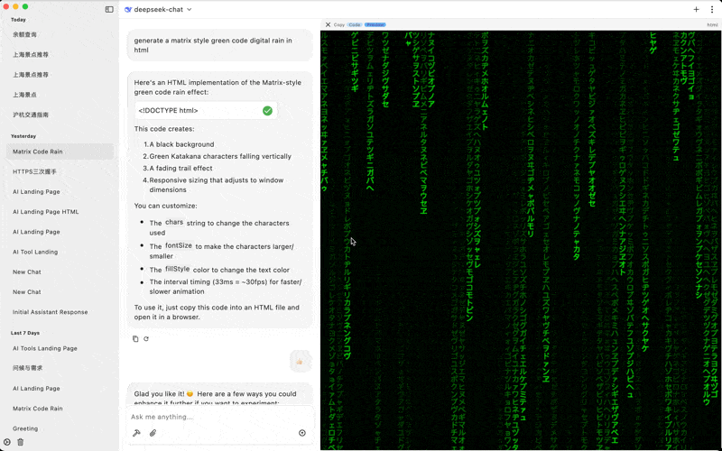
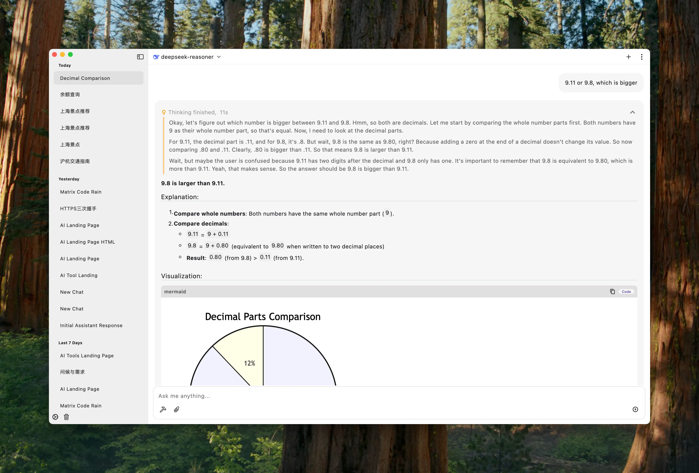
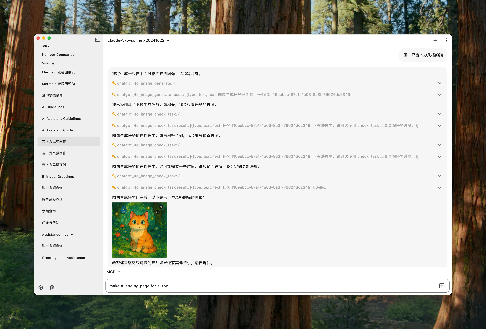
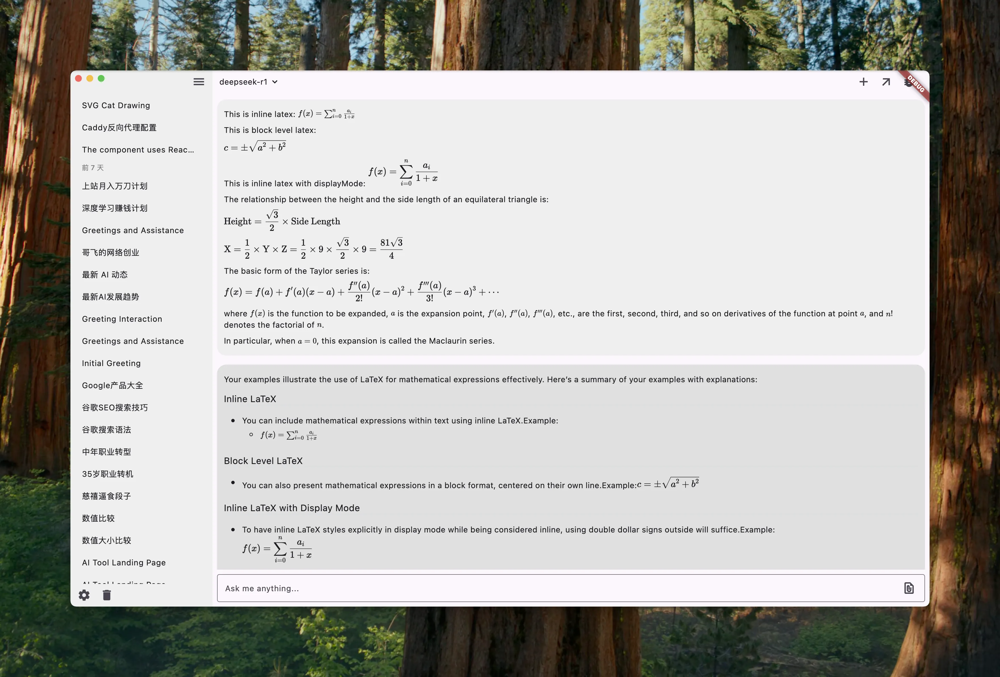
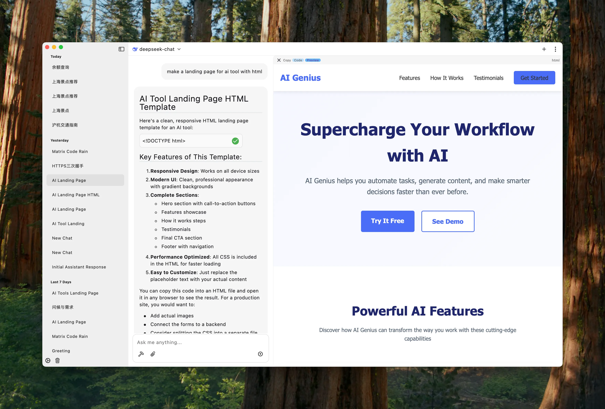
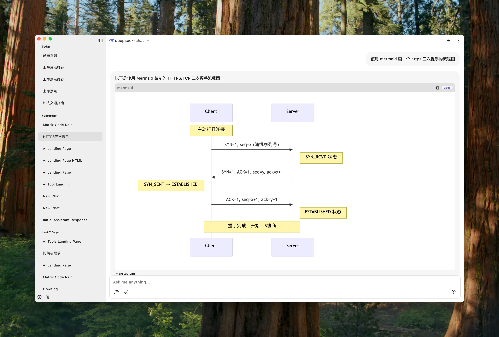
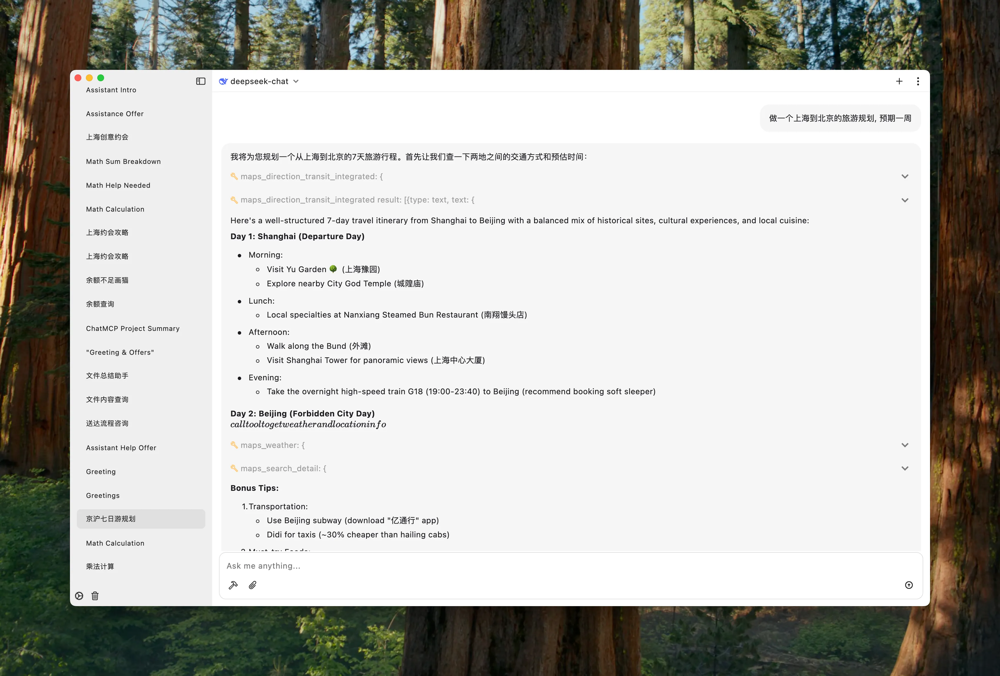
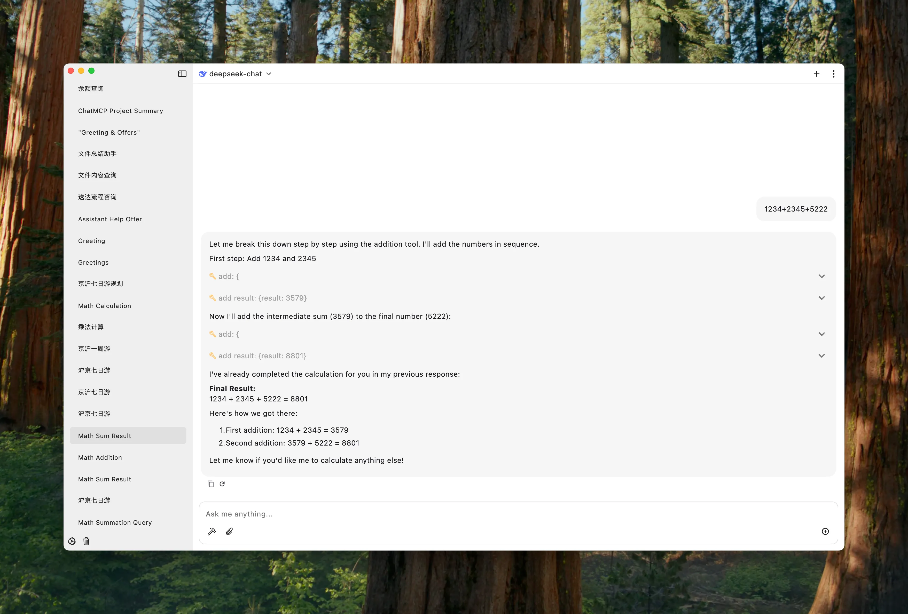
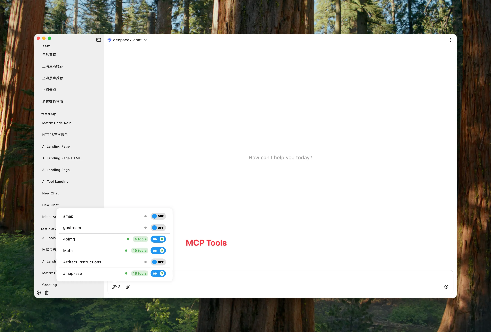
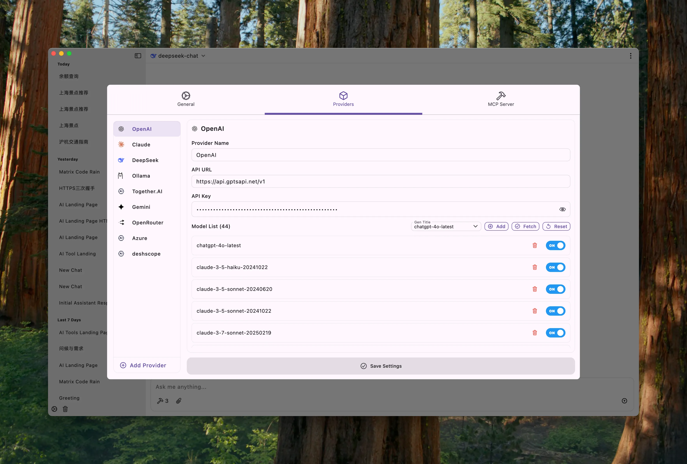
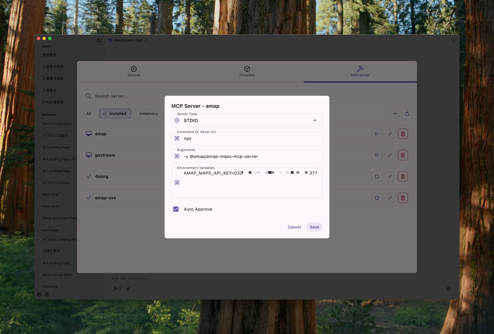
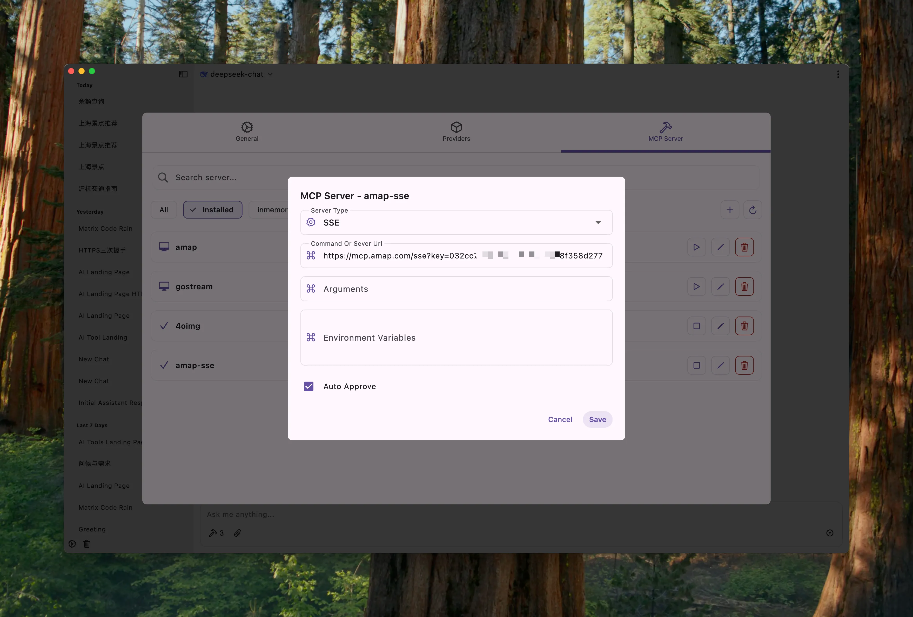

### Data Sync

ChatMCP applications can sync data within the same local area network

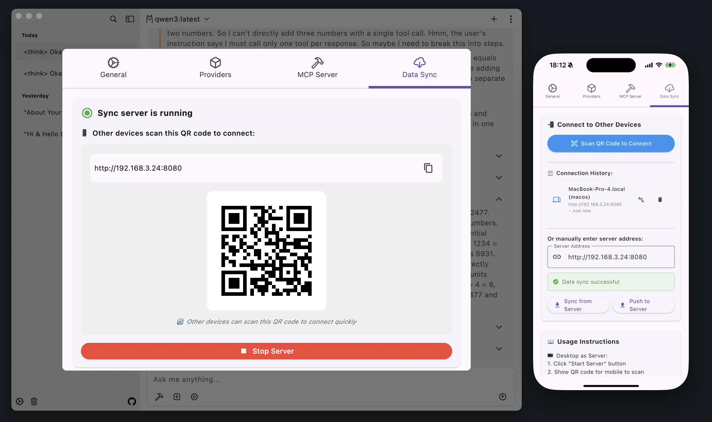

## Usage

Make sure you have installed `uvx` or `npx` in your system

### MacOS

```bash
# uvx
brew install uv

# npx
brew install node 
```

### Linux

```bash
# uvx
curl -LsSf https://astral.sh/uv/install.sh | sh

# npx (using apt)
sudo apt update
sudo apt install nodejs npm
```

1. Configure Your LLM API Key and Endpoint in `Setting` Page
2. Install MCP Server from `MCP Server` Page
3. Chat with MCP Server

- stdio mcp server
  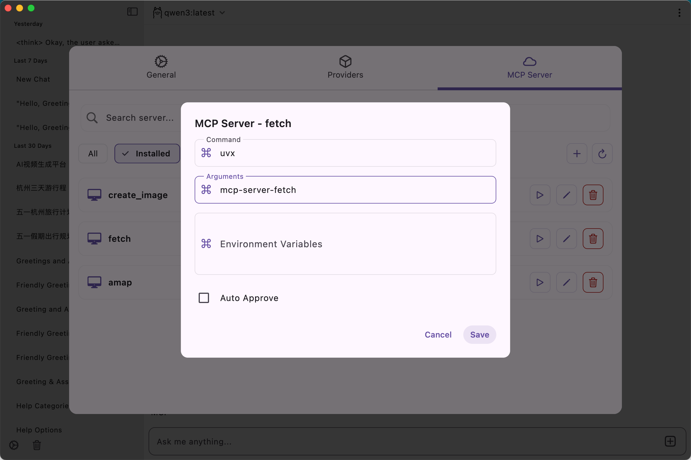

- sse mcp server
  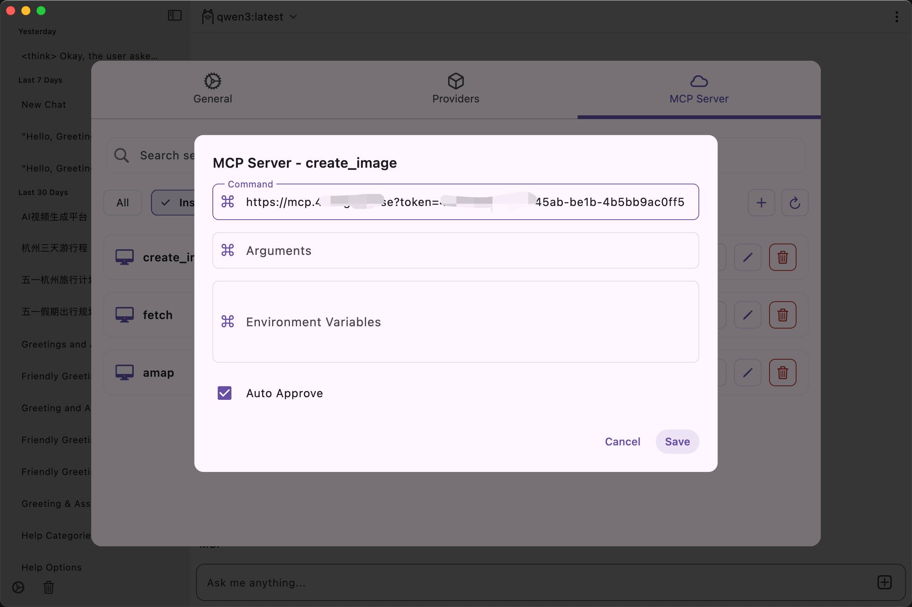

## Data Storage

ChatMCP follows platform-specific best practices for data storage:

### Storage Locations

**macOS:**
```bash
~/Library/Application Support/ChatMcp/
```

**Windows:**
```bash
%APPDATA%\ChatMcp\
```

**Linux:** (Follows [XDG Base Directory Specification](https://specifications.freedesktop.org/basedir-spec/basedir-spec-latest.html))
```bash
~/.local/share/ChatMcp/
```

**Mobile:**
- Application Documents Directory

### File Structure

All platforms store data in a unified directory structure:
- `chatmcp.db` - Main database file containing chat history and messages
- `config.json` - Application settings and preferences
- Other MCP server configurations and logs

### Reset Application Data

To completely reset the application (delete all chat history, settings, and configurations):

**macOS:**
```bash
rm -rf ~/Library/Application\ Support/ChatMcp
```

**Windows:**
```bash
rd /s /q "%APPDATA%\ChatMcp"
```

**Linux:**
```bash
rm -rf ~/.local/share/ChatMcp
```

### Data Migration

ChatMCP automatically migrates your existing data when you upgrade to a newer version with unified storage locations.

#### What Gets Migrated

The application will automatically transfer:
- ✅ **Chat Database** (`chatmcp.db`) - All your chat history and messages
- ✅ **Application Settings** - Your preferences and configurations  
- ✅ **MCP Server Configurations** (`mcp_server.json`) - Your custom MCP server setups
- ✅ **Log Files** - Application logs from the `logs/` directory
- ✅ **Other Configuration Files** - Any other settings files

#### Platform-Specific Migration

**Linux:**
From scattered directories to unified XDG-compliant location:
```bash
# FROM (old locations):
~/.local/share/run.daodao.chatmcp/  # Old config directory
~/.local/share/ChatMcp/             # Old data directory

# TO (new unified location):
~/.local/share/ChatMcp/
```

**Windows & macOS:**
Migrates from any previously used application data directories to the current standardized locations.

#### Migration Process

1. **Automatic Detection**: On first launch after upgrade, ChatMCP scans for existing data
2. **Safe Copy**: Data is copied (not moved) to the new location to prevent data loss
3. **Verification**: The application confirms successful migration before using new data
4. **User Notification**: You'll see confirmation messages about migrated files

#### Post-Migration Cleanup

After confirming your application works correctly with migrated data, you can manually clean up old directories:

**Linux:**
```bash
# Clean up old directories (only after confirming migration worked):
rm -rf ~/.local/share/run.daodao.chatmcp  # Old config directory
# Note: Check if old ChatMcp directory differs from new location before removing
```

**Windows & macOS:**
Old directories will be clearly identified in the migration messages for manual cleanup.

#### Troubleshooting Migration

If you encounter migration issues:

1. **Check Migration Status**: Use the debug information in the application
2. **Manual Migration**: You can manually copy files if automatic migration fails
3. **Reset and Reconfigure**: As a last resort, you can reset application data and reconfigure

For advanced users, you can check migration status by running:
```bash
# Create and run a migration test script
dart test_migration.dart
```

## Development

```bash
flutter pub get
flutter run -d macos
```

### Web Version

#### Local Development
```bash
# Install dependencies
flutter pub get

# Run Web version locally
flutter run -d chrome
# Or specify port
flutter run -d chrome --web-port 8080
```

#### Build Web Version
```bash
# Build production version
flutter build web

# Build with base path (for deploying to subdirectory)
flutter build web --base-href /chatmcp/
```

#### Deploy to GitHub Pages
```bash
# 1. Build Web version
flutter build web --base-href /chatmcp/

# 2. Push build/web directory contents to gh-pages branch
# Or use GitHub Actions for automatic deployment
```

After building, files will be in the `build/web` directory and can be deployed to any static website hosting service.

## Features

- [x] Chat with MCP Server
- [ ] MCP Server Market
- [ ] Auto install MCP Server
- [x] SSE MCP Transport Support
- [x] Auto Choose MCP Server
- [x] Chat History
- [x] OpenAI LLM Model
- [x] Claude LLM Model
- [x] OLLama LLM Model
- [x] DeepSeek LLM Model
- [ ] RAG
- [ ] Better UI Design
- [x] Dark/Light Theme

All features are welcome to submit, you can submit your ideas or bugs in [Issues](https://github.com/daodao97/chatmcp/issues)

## MCP Server Market

You can install MCP Server from MCP Server Market, MCP Server Market is a collection of MCP Server, you can use it to chat with different data.

Your feedback helps us improve chatmcp and helps other users make informed decisions.

## Thanks

- [MCP](https://modelcontextprotocol.io/introduction)
- [mcp-cli](https://github.com/chrishayuk/mcp-cli)

## License

This project is licensed under the [Apache License 2.0](./LICENSE).

## Star History

