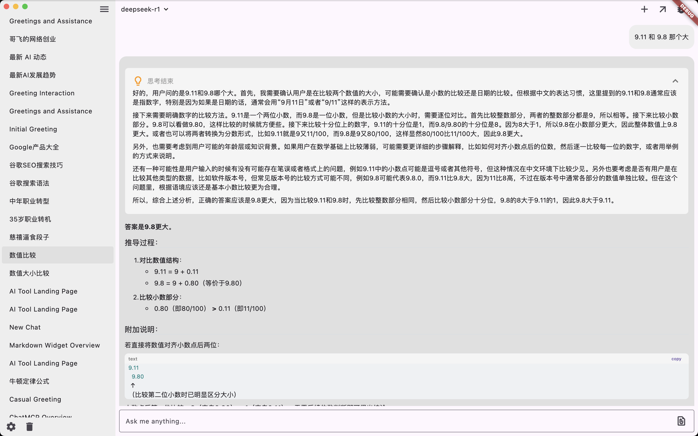
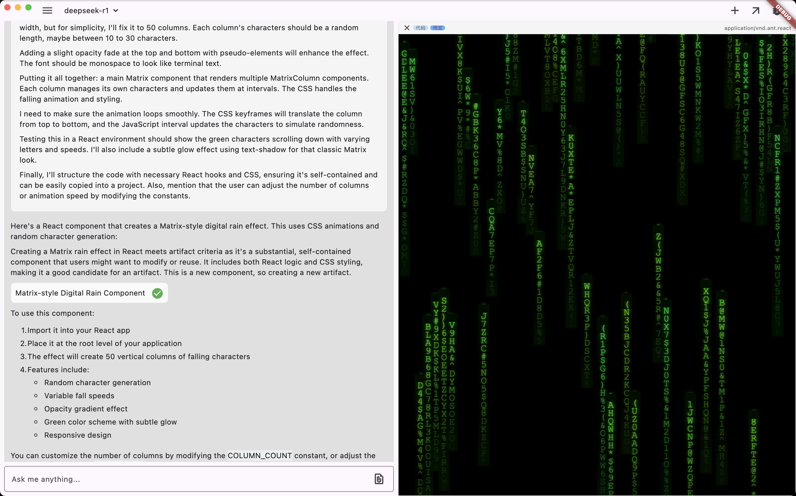
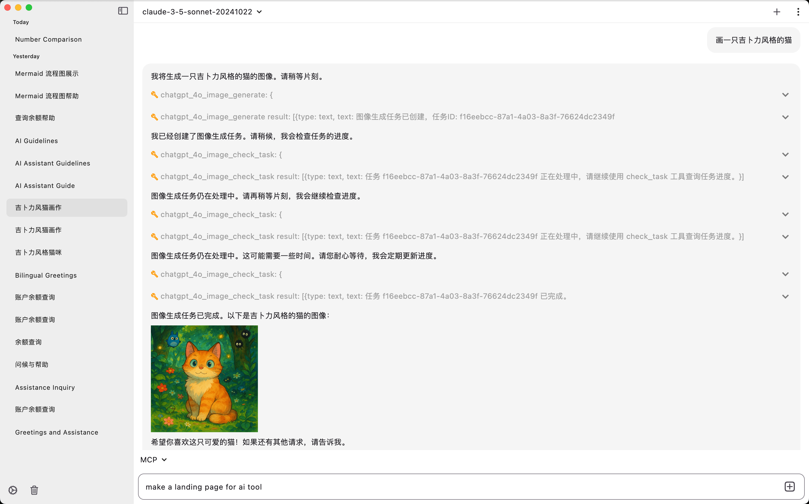
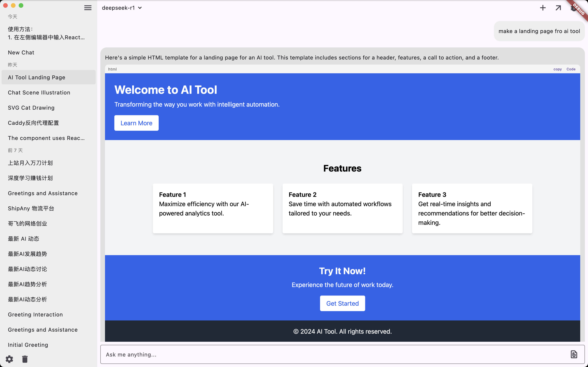
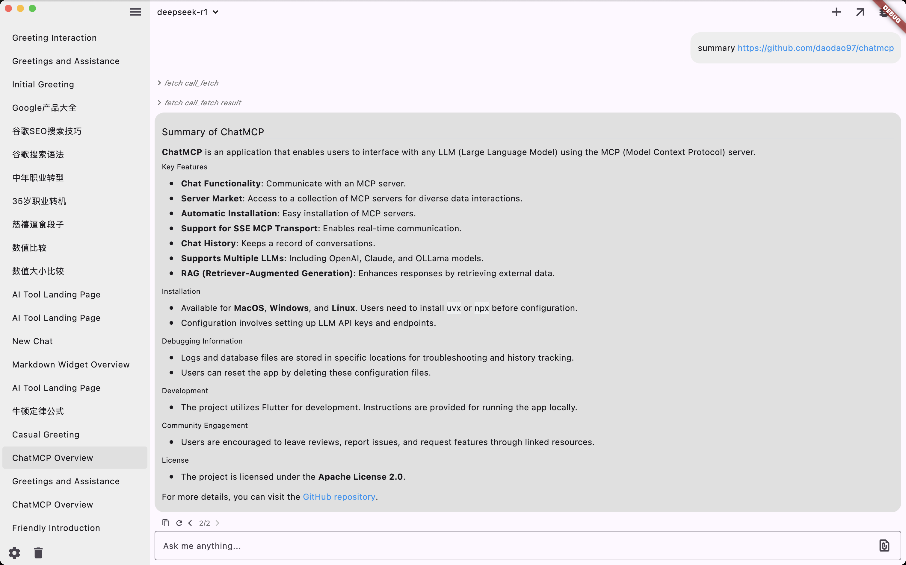
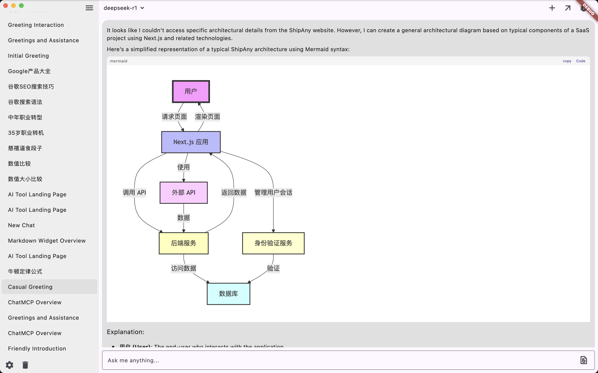
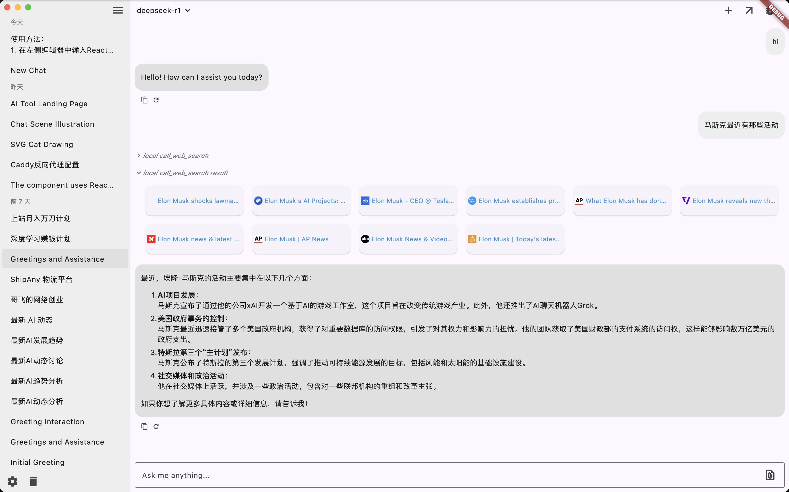

<div align="center">

<h1>chatmcp</h1>

跨平台 `MacOS | Windows | Linux | iOS | Android` AI 聊天客户端

[English](./README.md) | 简体中文

</div>

## 安装

桌面端：MacOS | Windows | Linux [release](https://github.com/daodao97/chatmcp/releases)

iOS：[TestFlight](https://testflight.apple.com/join/dCXksFJV)

Android：[release](https://github.com/daodao97/chatmcp/releases)

## 预览

### 深度思考


### 代码生成与审查


### Dalle 图像生成


### HTML 代码预览


### MCP 网址获取


### Mermaid 图表


### 网络搜索


## 使用方法

确保您的系统中已安装 `uvx` 或 `npx`

```bash
# uvx
brew install uv

# npx
brew install node 
```

1. 在"设置"页面配置您的 LLM API 密钥和端点
2. 从"MCP 服务器"页面安装 MCP 服务器
3. 与 MCP 服务器开始对话

## 调试

- 日志位置

`~/Library/Application Support/run.daodao.chatmcp/logs`

- 数据位置

`~/Library/Application Support/ChatMcp`

重置应用可以使用以下命令：

```bash
rm -rf ~/Library/Application\ Support/run.daodao.chatmcp
rm -rf ~/Library/Application\ Support/ChatMcp
```

## 开发

```bash
flutter pub get
flutter run -d macos
```

下载 [test.db](./assets/test.db) 用于测试 sqlite mcp 服务器


`~/Library/Application Support/ChatMcp/mcp_server.json` 是 mcp 服务器的配置文件

## 功能特性

- [x] 与 MCP 服务器对话
- [ ] MCP 服务器市场
- [ ] 自动安装 MCP 服务器
- [x] SSE MCP 传输支持
- [x] 自动选择 MCP 服务器
- [x] 聊天历史
- [x] OpenAI LLM 模型
- [x] Claude LLM 模型
- [x] OLLama LLM 模型
- [x] DeepSeek LLM 模型
- [ ] RAG 
- [ ] 更好的 UI 设计
- [x] 深色/浅色主题

欢迎提交任何功能建议，您可以在 [Issues](https://github.com/daodao97/chatmcp/issues) 中提交您的想法或错误报告。

## MCP 服务器市场

您可以从 MCP 服务器市场安装 MCP 服务器。MCP 服务器市场是 MCP 服务器的集合，您可以用它来与不同的数据进行对话。

您的反馈有助于我们改进 chatmcp，也能帮助其他用户做出明智的决定。

## 致谢

- [MCP](https://modelcontextprotocol.io/introduction)
- [mcp-cli](https://github.com/chrishayuk/mcp-cli)

## 许可证

本项目采用 [Apache License 2.0](./LICENSE) 许可证。
